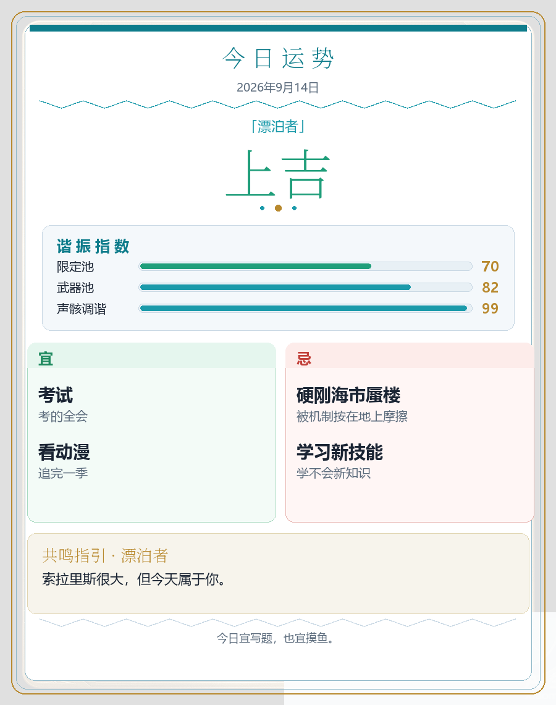
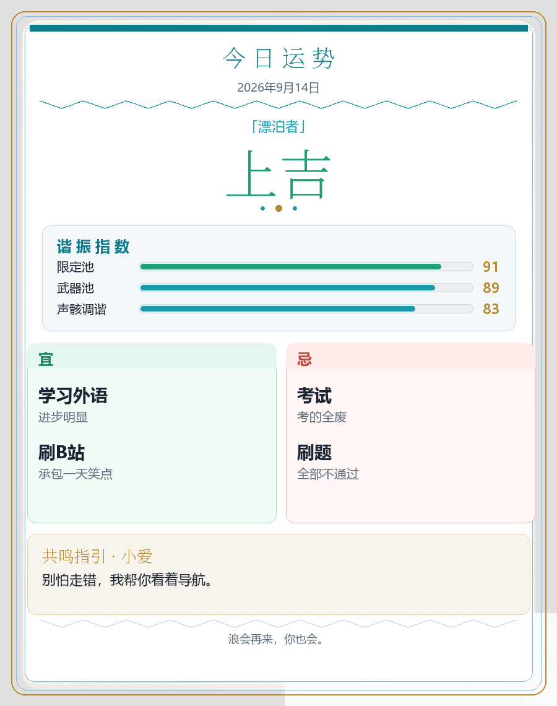

# astrbot-plugin-wuwa-luck

AstrBot 插件：鸣潮主题「今日运势」白底卡片。

## 示例





## 指令

- `/luck`
- `/今日运势`

## 安装

放到 AstrBot 插件目录即可：

```powershell
git clone https://github.com/baichui/astrbot_plugin_wuwa_luck.git
# 内容拷到 <AstrBot>/data/plugins/wuwa_luck/
```

目录结构（仓库根目录即插件）：

```text
wuwa_luck/
  main.py
  metadata.yaml
  _conf_schema.json
  image.py
  wuwa_data.py
  assets/bg.png
```

重启 AstrBot 后在 WebUI 启用。

## 配置（WebUI）

- **各角色出现权重**：0–100，0=不出现；小爱默认 80，其余默认 1
- **宜忌出现鸣潮文案的概率**：默认 0.3，全卡最多 1 条
- **谐振指数条目**：默认 限定池 / 武器池 / 声骸调谐

## 说明

- 基于洛谷运势修改：[plugin-luoguluck](https://github.com/LiteSuggarDEV/plugin-luoguluck)
- 同 UID + 昵称 + 日期当天结果固定
- 主角色语录 5 句；漂泊者多属性已合并
- 字体优先系统字体

## NoneBot 版

见 [baichui/wuwa_luck](https://github.com/baichui/wuwa_luck)。